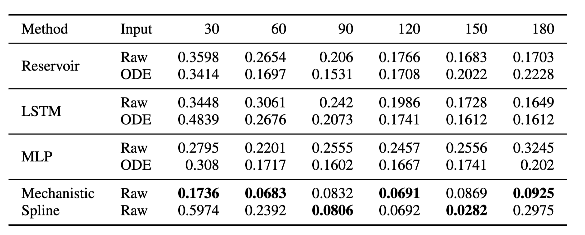

# RRI-PHDS-ODE-neural-net-study

A comparitive study of neural network models vs mechanistic ODE models for the task of forecasting with very limited and sparse data.

## Project Description

In study study we compare the performance of 3 distinct neural network architectures: an MLP, an ESN model with a reservoir, and an LSTM model against a mechanistic ODE model on a simple data forecasting task, using simulated patient data enriched with random missing values to mimic real-world scenarios. Given the sparse nature of the data, we performed various pre-processing steps such as imputation using SAITS and smoothing with a moving average to fill in the gaps. Reservoir and LSTM models were trained auto-regressively, while the MLP model leveraged initial data to make predictions at specific future points.

## Requirements
- pytorch 1.12
- pypots
- reservoirpy
- scikit-learn

(Optionally, you can perform a `pip install -r requirements.txt`)

## Usage

Instructions on how to use/run your project. This should include:


Example:
\```bash
git clone https://github.com/Deepayan137/health-forecast.git
cd health-forecast
pip install -r requirements.txt

\```

Data Preparation:

dowload the datafiles from this [gdrive link](https://drive.google.com/file/d/1dU0Jud300RWbRgFxK-u1zIOB84QW12b3/view?usp=drive_link)
untar the compressed file and put in `data` folder

### For training the LSTM model

`python -m src.train_lstm --out_dim 1 --epochs 600 --exp_name --trial 1`

For training an LSTM based model on outputs from a Mechanistic ODE model

`python -m src.train_lstm --out_dim 1 --epochs 600 --exp_name --trial 1 --use_ode`

### For Reservoir

step 1: Find the right hyper-parameters for the resevoir

`python -m src.reservoir.hp_search_optuna --nb_trial 40 --study_name hp_search --trial 1`

The parameter `--nb_trial` refers to the number of trials the huper-parameter search library will perfrom in a given search-space.

You can visualize the parameters by following the notebook at `src/reservoir/visualize.ipynb`

For more information on hyperparameter-search, please refer to this [link](https://reservoirpy.readthedocs.io/en/latest/user_guide/hyper.html)

step 2: Once the hyper-parameters are fixed you can run

`python -m src.reservoir.main --trial 1`

This command will train the reservoir model and output the forecast results on specified days.

**Note:** You can perform the hp-search and forecast on the outputs of the mechanistic model by adding the `--use_ode` flag, similar to how we did for the LSTM model.


### For MLP

`python -m src.train_mlp --trial 1`

for ode based inputs

`python -m src.train_mlp --trial 1 --use_ode`

For all the methods, the above-mentioned commands will output the forecast results 
on specified days on the terminal and also generate csv files with metrics such
as bias and mse at `results/metrics/`

## Results

Discuss the results of your research or project. This could include:



The above table outlines the RMSE results of our models. The Mechanistic ODE model, with with the least RMSE stands out, emphasizing its ability to predict with high accuracy even with sparse data. The Reservoir and LSTM models also reported competitive RMSE values, with a notable performance from the LSTM model with a RMSE of 0.165 on the 180th day with raw input.

